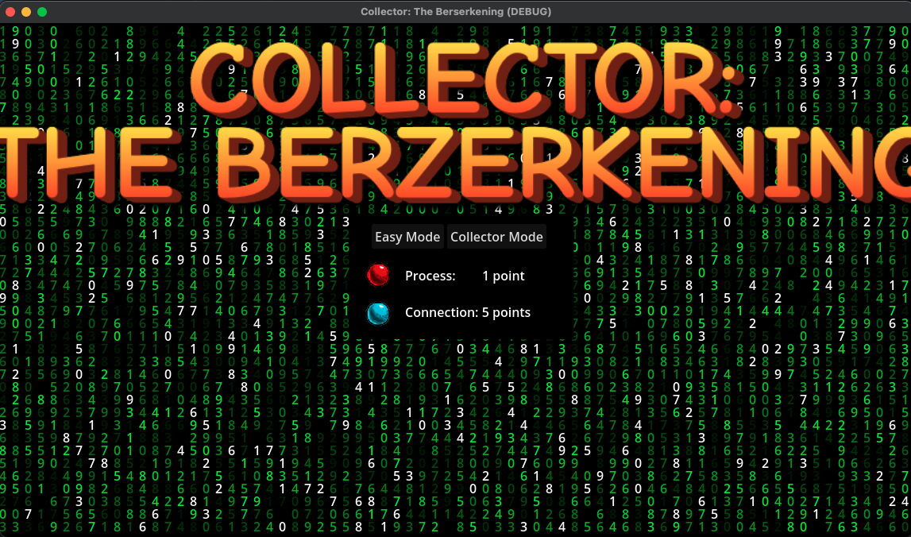
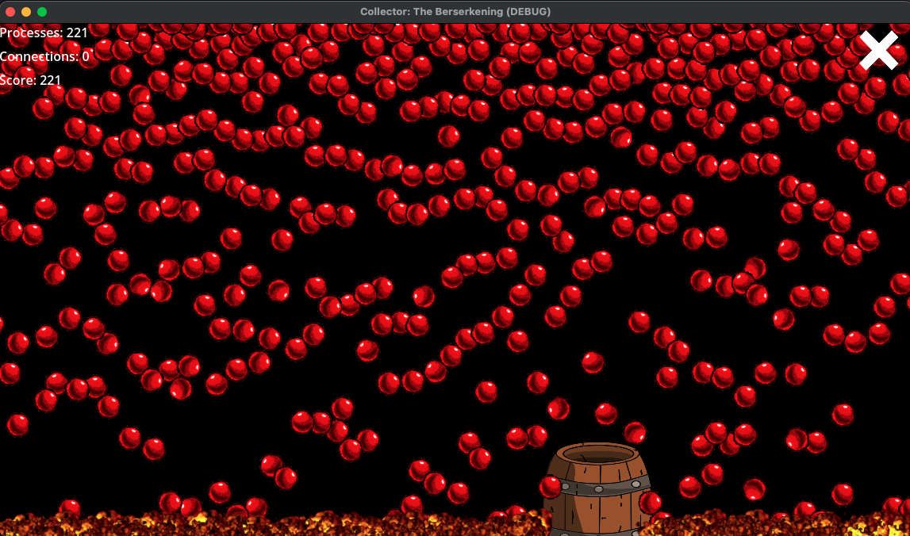

## Collector: The Berzerkening

This is the source code to a ~~game~~ Collector runtime data visualization tool,
where you try to catch ~~balls~~ process and network events with a barrel.

In demo mode, this will start up a mock sensor alongside collector and feed
events directly into the game, to visualize the events and provide difficulty
levels.

This is currently hosted at: https://collector-berzerkening.netlify.app

WARNING: On MacOS browsers (tested on Firefox and Chrome) there is a
[known bug](https://github.com/godotengine/godot/issues/70691) in
Godot Web exporting where load times and resource use are very large (1-2
minutes to load, with the browser sometimes becoming unresponsive in that time)
Proceed at your own risk.

Alternatively, download [Godot 4](https://godotengine.org/), and import the
project directly.
